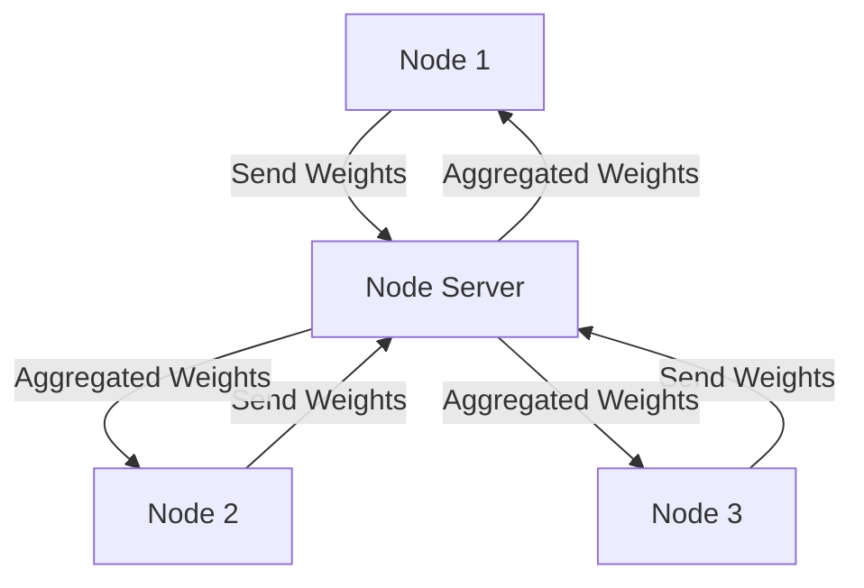
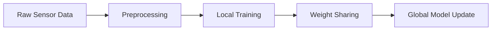

# System Architecture

## Overview
The Swarm Learning Fall Detection System is a distributed machine learning system that enables collaborative model training while maintaining data privacy. The system consists of multiple nodes that communicate through ZeroMQ, sharing model weights while keeping raw data local.

## System Components

### 1. Node Server (`node_server.py`)
The node server is responsible for handling inter-node communication and weight aggregation.

#### Key Responsibilities:
- ZeroMQ socket management
- Weight reception and storage
- Weight aggregation
- Global model maintenance

#### Communication Flow:


### 2. Training Node (`node.py`)
The training node handles local model training and data processing.

#### Key Responsibilities:
- Data loading and preprocessing
- Local model training
- Weight sharing with peers
- Differential privacy implementation

#### Data Flow:


### 3. Entry Point (`entrypoint.py`)
The entry point orchestrates the startup and management of node processes.

#### Key Responsibilities:
- Process initialization
- Environment configuration
- Error handling
- Cleanup procedures

## Model Architecture

### CNN-LSTM Hybrid Model
The system uses a hybrid CNN-LSTM architecture for fall detection:

```python
model = Sequential([
    Conv1D(filters=64, kernel_size=3, activation='relu', input_shape=input_shape),
    Conv1D(filters=128, kernel_size=3, activation='relu'),
    MaxPooling1D(pool_size=2),
    Conv1D(filters=128, kernel_size=3, activation='relu'),
    LSTM(64),
    Dense(64, activation='relu'),
    Dropout(0.5),
    Dense(num_classes, activation='softmax')
])
```

### Layer Details:
1. **Input Layer**: Accepts sensor data (accelerometer and gyroscope readings)
2. **Convolutional Layers**: Extract spatial features from sensor data
3. **LSTM Layer**: Captures temporal dependencies
4. **Dense Layers**: Process combined features for classification
5. **Output Layer**: Predicts fall/non-fall classes

## Communication Protocol

### ZeroMQ Implementation
- Uses REQ/REP pattern for reliable communication
- Implements timeout mechanisms for fault tolerance
- Supports asynchronous message handling

### Message Types:
1. **Weight Sharing**
   - Format: JSON with base64-encoded weights
   - Includes noise for differential privacy
   - Contains metadata (node ID, timestamp)

2. **Model Updates**
   - Format: JSON with model parameters
   - Includes version information
   - Contains aggregation status

## Security Architecture

### Differential Privacy
- Gaussian noise injection in shared weights
- Configurable noise parameters
- Privacy budget management

### Data Protection
- Local data processing
- Encrypted weight transmission
- Access control mechanisms

## Performance Considerations

### Resource Management
- Memory-efficient weight serialization
- Optimized tensor operations
- Efficient network communication

### Scalability
- Horizontal scaling through node addition
- Load balancing in weight aggregation
- Efficient resource utilization 